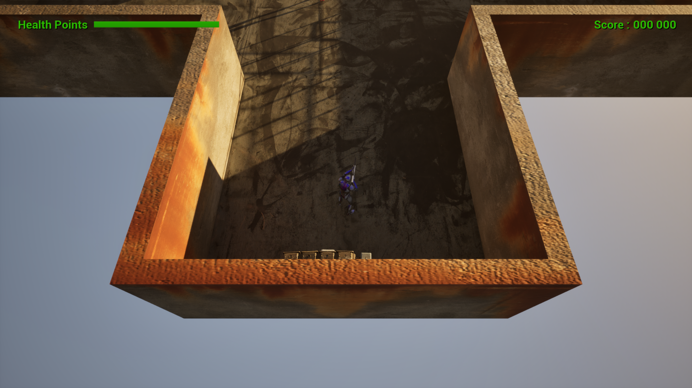
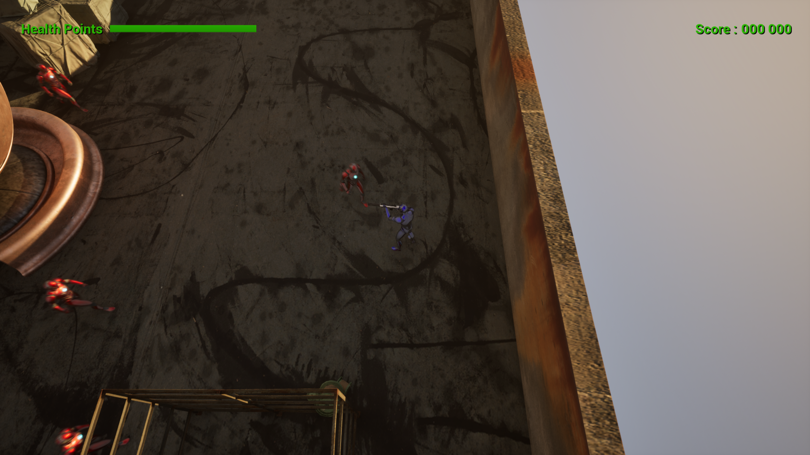
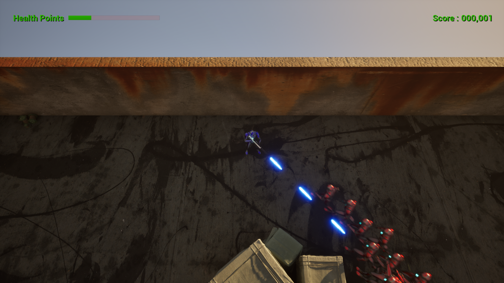
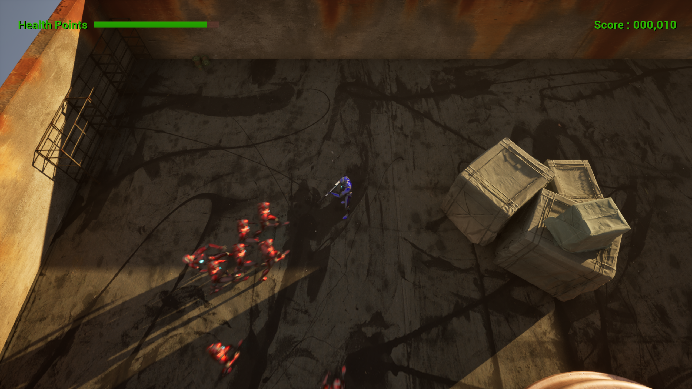
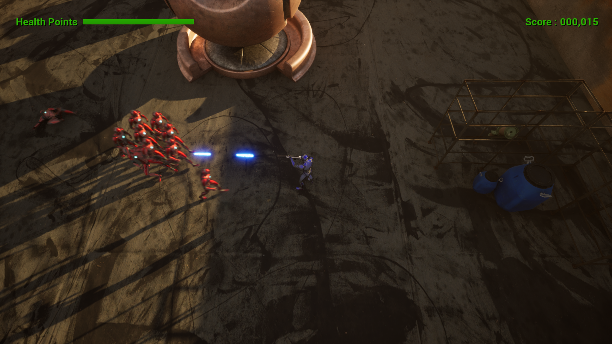
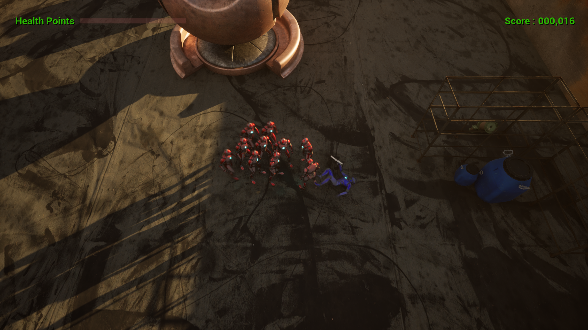

# Unreal Engine Top-Down Shooter

Welcome to my Unreal Engine 5 Top-Down Shooter game ! This project is the result of following a comprehensive tutorial to learn various features and functionalities of Unreal Engine 5. I hope you enjoy playing it as much as I enjoyed creating it.

## Features

- Developed using Unreal Engine 5.
- Top-down shooter gameplay.
- Learned and implemented multiple Unreal Engine features through a detailed tutorial.

## How to Play

There is currently no in-game menu. To exit the game, please press `ALT + F4`.

## Download and Play

You can download the game by visiting my itch.io page to download the game :
- [al3xics.itch.io](https://al3xics.itch.io/)

## Installation

1. Download the `UnrealTopDownShooter.zip` file from the link above.
2. Extract the contents of the zip file to your desired location.
3. Run the executable file to start the game.

## Acknowledgements

This project was made possible thanks to the tutorial that guided me through the various aspects of using Unreal Engine 5. Special thanks to the creators of the [tutorial](https://youtu.be/hn98tbztoBg) and the Unreal Engine community for their support and resources. 
 

### Enjoy the game!
 

# Here are some images of the game : 

